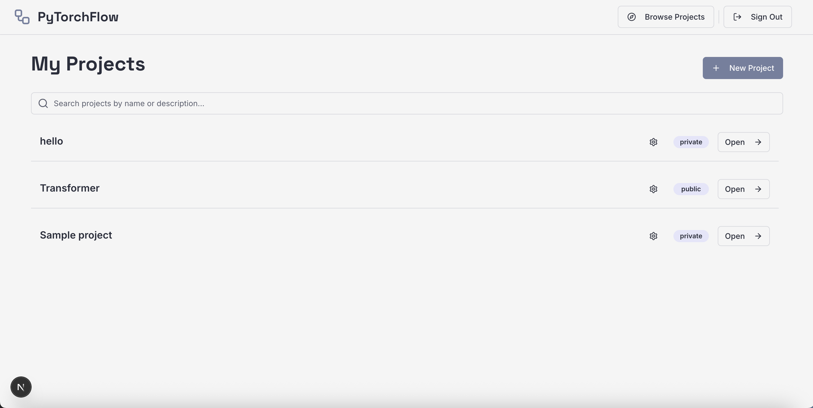

# PyTorchFlow

PyTorchFlow is a visual, drag-and-drop interface for designing PyTorch models and workflows. Built with Next.js and React Flow, it allows users to intuitively construct complex logic by assembling nodes representing various operations, layers, and logic blocks.


## Table of Contents

- [Project Overview](#project-overview)
- [Key Features](#key-features)
- [Tech Stack](#tech-stack)
- [Project Structure](#project-structure)
- [Getting Started](#getting-started)
- [Project Files](#project-files)
- [Sample Images](#sample-images)

## Project Overview

PyTorchFlow aims to lower the barrier to entry for machine learning experimentation by providing a GUI for what is traditionally a code-heavy process. Users can select components from a sidebar, drag them onto a canvas, connect them to define data flow, and configure parameters for each step. The application supports project management, allowing users to save their work and even import existing projects as reusable modules within new flows.

## Key Features

- **Interactive Canvas:** A limitless workspace to drag, drop, and connect nodes using [React Flow](https://reactflow.dev/).
- **Component Sidebar:** A categorized library of nodes including Start/End points, Processing units, Decisions (logic), Delays, I/O, and Documentation.
- **Node Configuration:** Click on any node to open a configuration panel where you can fine-tune specific parameters (e.g., hyperparameters, labels).
- **Project Management:** Create, view, update, and delete projects. Authenticated via Firebase.
- **Project Imports:** Import entire existing projects as single nodes into your current workspace to encapsulate and reuse logic.
- **Interaction Modes:** Switch between "Selection" mode for editing and "Pan" mode for navigating large graphs.

## Tech Stack

- **Framework:** [Next.js](https://nextjs.org/) (App Router)
- **Language:** TypeScript
- **Styling:** [Tailwind CSS](https://tailwindcss.com/)
- **UI Components:** [Shadcn/UI](https://ui.shadcn.com/) (Radix UI)
- **Flow Chart Library:** [React Flow](https://reactflow.dev/)
- **Icons:** [Lucide React](https://lucide.dev/)
- **Backend / Auth:** [Firebase](https://firebase.google.com/) (Firestore, Auth)

## Project Structure

The project follows a standard Next.js App Router structure:

```
pytorch-flow/
├── docs/                   # Documentation and blueprints
├── public/                 # Static assets
├── sample_images/          # Screenshots for README
├── src/
│   ├── app/                # Next.js App Router pages
│   │   ├── (app)/          # Protected routes (Dashboard, Projects)
│   │   ├── explore/        # Public exploration routes
│   │   └── ...
│   ├── components/
│   │   ├── components/     # Application-specific components
│   │   │   └── flow/       # Core flow editor components (Canvas, Sidebar, etc.)
│   │   ├── screens/        # Screen-level components (Page layouts)
│   │   ├── provider/       # Context providers (Auth, Projects)
│   │   └── ui/             # Generic UI components (Buttons, Inputs, etc.)
│   ├── hooks/              # Custom React hooks (useAuth, useProjects)
│   └── lib/                # Utilities, Types, and Firebase configuration
├── next.config.ts          # Next.js configuration
├── tailwind.config.ts      # Tailwind CSS configuration
└── package.json            # Dependencies and scripts
```

## Getting Started

1.  **Clone the repository:**

    ```bash
    git clone https://github.com/kaitosuzuki-CS/Practice.git
    cd pytorch-flow
    ```

2.  **Install dependencies:**

    ```bash
    npm install
    # or
    yarn install
    ```

3.  **Environment Setup:**
    Create a `.env.local` file in the root directory and add your Firebase configuration keys:

    ```env
    NEXT_PUBLIC_FIREBASE_API_KEY=...
    NEXT_PUBLIC_FIREBASE_AUTH_DOMAIN=...
    NEXT_PUBLIC_FIREBASE_PROJECT_ID=...
    NEXT_PUBLIC_FIREBASE_STORAGE_BUCKET=...
    NEXT_PUBLIC_FIREBASE_MESSAGING_SENDER_ID=...
    NEXT_PUBLIC_FIREBASE_APP_ID=...
    NEXT_PUBLIC_FIREBASE_MEASUREMENT_ID=...
    ```

4.  **Run the development server:**

    ```bash
    npm run dev
    ```

5.  **Open the application:**
    Navigate to `http://localhost:3000` in your browser.

## Project Files

Here is a breakdown of some of the most critical files in the application:

### Core Flow Components (`src/components/components/flow/`)

- **`canvas.tsx`**: The heart of the editor. This component wraps the `ReactFlow` instance, handling node/edge state, drag-and-drop logic (creating new nodes from the sidebar), connection handling, and synchronizing the flow state with the parent project object.
- **`sidebar.tsx`**: Renders the draggable list of components on the left side of the screen. It organizes components into categories (e.g., Process, Logic) and handles the drag-start events that pass data to the Canvas.
- **`configPanel.tsx`**: A dynamic side sheet that opens when a node is selected. It reads the node's schema (defined in `flow-components.ts`) and generates a form using `react-hook-form` to let users edit node parameters.
- **`projectViewer.tsx`**: A read-only version of the canvas used for "View Only" modes or previews.

### Screens (`src/components/screens/`)

- **`userProjectScreen.tsx`**: The main layout for the project editor. It coordinates the `Header` and `Canvas` components, managing the project state and interaction modes (Selection vs. Pan).
- **`dashboardScreen.tsx`**: The user's landing page after login, displaying a grid of their saved projects with options to create new ones or delete existing ones.

### Application Logic (`src/app/`)

- **`src/app/(app)/projects/[id]/page.tsx`**: The dynamic route for opening a specific project. It fetches the project ID from the URL and renders the `UserProjectScreen`.
- **`src/lib/flow-components.ts`**: Acts as the registry for all available node types, defining their default parameters, labels, and configuration schema used by the `ConfigPanel`.

## Sample Images

### Dashboard



### Create Project


### Main Project Page


### Configure Parameters


### Import Project Page


